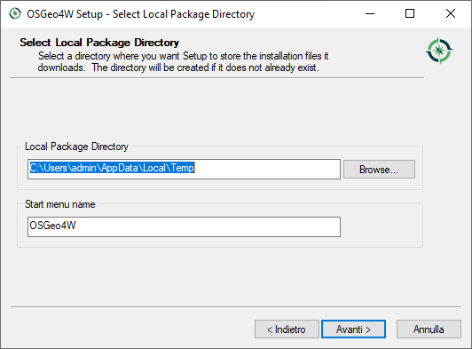

Introduzione
==================

Installazione di QGIS per Windows
------------------------------------------
QGIS è un software free ed open source cross-platform https://qgis.org/. 

Su S.O. Windows presenta due diverse modalità di installazione:

* installazione standalone 
* installazione con l'OsGeo Network installer

Questo brevissimo tutorial è dedicato a utenti inesperti che vogliano installare QGIS utilizzando l'OsGeo installer in maniera semplice e consente 
l'installazione di due diverse versioni di QGIS:

* l'ultima versione di QGIS
* l'ultima versione stabile (LTR: Long Term Release) di QGIS

Utilizzando l'OsGeo installer sarà estremamente semplice aggiungere eventuali pacchetti aggiuntivi e soprattutto gestire i successivi aggiornamenti 
software.

Step suggeriti
--------------------------------------------

Installazione dell'ultima versione (express install)
**************************************************************
La maniera più semplice per installare l'ultima versione di QGIS è selezionare l'opzione *Express Desktop Install*

.. image:: img/01.PNG

Selezionare un server fra quelli disponibili (con questa funzione la velocità potrebbe essere variabile). 

.. image:: img/02.PNG

Selezionare i pacchetti base (QGIS, GDAL e GRASS GIS)

.. image:: img/03.PNG

Accettare che L'OsGeo Network Installer selezioni alcune dipendenze

Accettare le licenze aggiuntive di alcune dipendenze (es. ERDAS License per il supporto ECW)

A questo punto occorre attendere che si scarichino i pacchetti e successivamente si installi il Software. L'attesa minima è di 
alcuni minuti anche se ovviamente dipende sia dalla velocità di rete che del PC

Salvataggio dell'OsGeo Network Installer
**************************************************************

A questo punto si sottolinea come sia bene salvare l'OsGeo network installer per successivi richiami del software in un apposita cartella. 

A titolo di esempio si potrebbe salvare sulla cartella OsGeo che di default viene linkata sul desktop con con l'installazione dell'ultima versione di QGIS 

Installazione della versione stabile (LTR)
**************************************************************

A questo punto riaprire l' OsGeo Network Installer e selezionare l'opzione *Advanced Install* 

Procedere cliccando avanti salvo modificare le proprie configurazioni di rete se necessario

A un certo punto si giungerà alla seguente pagina dove vanno scelti i due pacchetti nella sezione *Desktop*:

* qgis-ltr
* qgis-ltr-full

Accettare nuovamente e attendere qualche minuto. In questo caso siccome molte dipendenze risultano già installate l'attesa dovrebbe essere notevolmente inferiore.

A questo punto avete installato sul vostro PC Windows sia l'ultima versione di QGIS che l'ultima stabile e potrete scegliere in ogni momento quale utilizzare

Il tutorial è stato realizzato da `Gter srl`_  e distribuito con licenza https://creativecommons.org/licenses/by/4.0/

.. _Gter srl: https://www.gter.it
